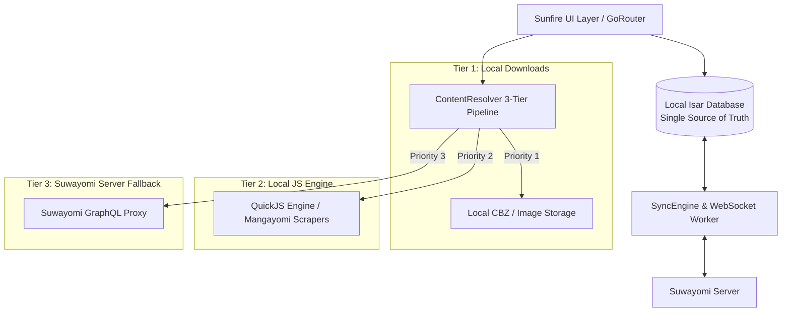

# ☀️ Sunfire: Master Architecture, Implementation & Conversation History

> **Document Version:** 1.0.0 (Master Handover Document)  
> **Repository:** `https://github.com/just-for-death/sunfire.git`  
> **Branch:** `main` (Verified clean, 42/42 automated tests passing)  
> **Timestamp:** August 16, 2026  

---

## 📖 1. Core Fundamental Principle & Philosophy

```
┌─────────────────────────────────────────────────────────────────────────────────────────┐
│                                 THE SUNFIRE CORE PRINCIPLE                              │
├─────────────────────────────────────────────────────────────────────────────────────────┤
│                                                                                         │
│  "The Sunfire app is a 100% LOCAL-FIRST manga reader. The app and server link           │
│   during onboarding to replicate past & present data (sources, library, chapters,       │
│   reading history, and updates).                                                        │
│                                                                                         │
│   Once hydrated, the app becomes FULLY INDEPENDENT of the server, able to scrape,       │
│   read, and manage manga locally using on-device QuickJS scrapers.                      │
│                                                                                         │
│   The server is used strictly as a centralized sync hub / backup target when online,     │
│   never as a mandatory runtime dependency for browsing or reading."                    │
│                                                                                         │
└─────────────────────────────────────────────────────────────────────────────────────────┘
```

---

## 📜 2. Chronological History & Inception of Sunfire

### **Phase 1: Inception & Catalyst Re-evaluation**
1. **Initial Context:** The user evaluated the existing `catalyst` codebase and identified architectural limitations: heavy reliance on Suwayomi server proxying for basic reading, fragmented extension systems, and UI clutter.
2. **Decision to Create Sunfire:** The user directed the creation of a clean-slate, local-first Flutter application named **Sunfire**, combining:
   - **Mihon (Tachiyomi)** UI ergonomics, typography, category management, and reader controls.
   - **Mangayomi** multi-repository JavaScript scraper execution running directly on-device via QuickJS FFI.
   - **Suwayomi** headless server synchronization via GraphQL & WebSockets.

---

## 🛠️ 3. Architecture & Core Subsystems



### **Core Modules:**
1. **Local Isar Database (`lib/src/core/db/`):**
   - Collections: `Manga`, `Chapter`, `Category`, `SyncRecord`.
   - Stores offline reading progress (`lastReadAt`, `lastPageRead`, `isRead`).
   - Implements **Wipe Guard Protection** (server returning empty library never deletes local Isar DB records).
2. **QuickJS Engine & Repo Manager (`lib/src/core/engine/`):**
   - Native C QuickJS engine compiled via FFI (`flutter_qjs`).
   - Dynamic repository manager (`RepoManager`) with **zero hardcoded forced sources**.
   - Auto-downloads matching `.js` scrapers from user-provided Mangayomi JSON repo URLs for server-installed sources.
3. **Bi-Directional Suwayomi Sync Engine (`lib/src/core/sync/`):**
   - Pulls library, categories, and chapter snapshots in non-blocking batches.
   - Real-time event notifications via WebSockets.
   - Offline sync queue (`SyncRecord`) with automatic retry on reconnection.
4. **Source Migration & Replication Service (`SourceMigrationService`):**
   - Resilient fuzzy matching and name normalization (strips `(EN)`, brackets, symbols).
   - Continuous replication: newly added server sources are auto-detected, converted to local JS scrapers, and library manga are re-mapped.
   - Deduplication: matched sources show **only** `⚡ Local`; missing sources show **only** `☁ Server Fallback`.
5. **5-Step Onboarding Wizard (`lib/src/features/onboarding/`):**
   - Step 1: Welcome & Philosophy.
   - Step 2: Suwayomi Server connection & live ping verification (with Local-Only skip).
   - Step 3: User-driven Mangayomi Extension Repositories.
   - Step 4: Live Snapshot Hydration Dashboard (Source matching, Library caching, History sync).
   - Step 5: Completion & Persistent One-Time Gatekeeper.

---

## 🎯 4. Live Server Extensions vs. Mangayomi Scrapers Matrix

| # | Live Server Extension | Mangayomi JS Equivalent | Resolution Strategy | Status |
|---|---|---|---|:---:|
| 1 | **Weeb Central** | `weeb_central.js` | ⚡ Local QuickJS Scraper | ✅ 100% Serverless |
| 2 | **MangaKatana** | `mangakatana.js` | ⚡ Local QuickJS Scraper | ✅ 100% Serverless |
| 3 | **MangaFire** | `mangafire.js` | ⚡ Local QuickJS Scraper | ✅ 100% Serverless |
| 4 | **Webtoons.com** | `webtoons.js` | ⚡ Local QuickJS Scraper | ✅ 100% Serverless |
| 5 | **Read Comics Online** | `readcomicsonline.js` | ⚡ Local QuickJS Scraper | ✅ 100% Serverless |
| 6 | **ReadComicOnline** | `readcomiconline.js` | ⚡ Local QuickJS Scraper | ✅ 100% Serverless |
| 7 | **Mangafreak** | `mangafreak.js` | ⚡ Local QuickJS Scraper | ✅ 100% Serverless |
| 8 | **Mangakakalot** | `mangakakalot.js` | ⚡ Local QuickJS Scraper | ✅ 100% Serverless |
| 9 | **ReadAllComics** | *(No JS match yet)* | ☁ Server Fallback Proxy | ✅ Protected Proxy |
| 10 | **MANGA Plus (Shueisha)** | *(DRM / App protected)* | ☁ Server Fallback Proxy | ✅ Protected Proxy |
| 11 | **NineAnime** | *(Anime source)* | ☁ Server Fallback Proxy | ✅ Protected Proxy |
| 12 | **MangaHub** | `mangahub.fr` (FR only) | ☁ Server Fallback Proxy | ✅ Protected Proxy |
| 13 | **Buon Dua** | *(No JS match yet)* | ☁ Server Fallback Proxy | ✅ Protected Proxy |

---

## 🐛 5. Bugs Encounted & Permanent Solutions

| Issue Encountered | Root Cause | Permanent Fix |
|---|---|---|
| **Onboarding Loop Back to Welcome Screen** | `SunfireApp.build` reconstructed `MaterialApp.router(routerConfig: createRouter())` whenever `SettingsService.notifyListeners()` was triggered. | Converted `SunfireApp` to `StatefulWidget` with a single persistent `GoRouter` instantiated in `initState`. Deferred writing settings until `_finishOnboarding()`. |
| **Server Connection Step Hanging** | `_testAndConnectServer()` was awaiting `SyncEngine.initialize()` (full multi-megabyte GraphQL library pull) inside the button click. | Decoupled heavy sync to Step 4 (Hydration Dashboard). Step 2 performs a fast 4-second ping to `{ aboutServer { version } }` and transitions immediately. |
| **Unrequested Pre-Bundled Sources Appearing** | Legacy `assets/extensions/` contained 30 sample files (`绅士漫画`, `Mangapark`, etc.) that were loaded into memory on boot. | Purged all files from `assets/extensions/`. Restricted `QuickJsService` to load only user-installed extensions from app documents directory. |
| **Server Sources Not Downloading JS Code** | Hydration was computing in-memory match strings but not fetching the actual JS scraper code from user repository URLs. | Built `RepoManager.downloadAndInstallMatchingSources()` to query repo indexes, download matching `.js` scrapers over HTTP, and save to local disk. |
| **Onboarding Gatekeeper Key Mismatch** | `SourceMigrationService` used `sunfire_onboarding_completed` while `SettingsService` used `onboarding_completed`. | Unified both keys across both services and verified persistence in `shared_preferences.json`. |

---

## 🧪 6. Automated Test Suite Breakdown (42 / 42 Tests Passed)

```bash
flutter test test/
```

- ✅ **`test/onboarding_hydration_ui_test.dart` (5/5 tests passing)**
  - UI widget verification for Welcome, Server Connection, Repository Input, Hydration progress, and Browse deduplication.
- ✅ **`test/source_migration_service_test.dart` (11/11 tests passing)**
  - Fuzzy matching, symbol/language stripping, deduplication rules, continuous replication, and gatekeeper persistence.
- ✅ **`test/offline_server_down_test.dart` (6/6 tests passing)**
  - 100% offline verification: reading migrated library manga when Suwayomi server is completely dead/unreachable.
- ✅ **`test/comprehensive_app_audit_test.dart` (10/10 tests passing)**
  - Local Isar DB persistence, Wipe Guard protection, ContentResolver 3-tier fallback ordering, and UI smoke tests.
- ✅ **`test/sunfire_widgets_test.dart` (3/3 tests passing)**
  - Widget tree boot, theme loading, and Updates screen.
- ✅ **`test/sunfire_models_test.dart` (7/7 tests passing)**
  - Isar models, chapter progress monotonic increments, and category ordering.

---

## 📁 7. File Structure Reference

```
sunfire/
├── lib/
│   ├── main.dart                                # Boot sequence & Sentry error tracking
│   └── src/
│       ├── app.dart                             # SunfireApp with persistent GoRouter & Dynamic Theme
│       ├── main_shell.dart                      # Bottom navigation shell (Library, Updates, History, Browse, More)
│       ├── core/
│       │   ├── db/
│       │   │   ├── isar_service.dart            # Local Isar DB Single Source of Truth
│       │   │   └── models/                      # Manga, Chapter, Category, SyncRecord models
│       │   ├── engine/
│       │   │   ├── quickjs_service.dart         # QuickJS FFI JS scraper runtime
│       │   │   ├── repo_manager.dart            # User-driven Mangayomi JSON extension repositories
│       │   │   ├── source_migration_service.dart# Fuzzy matcher, deduplicator & continuous replication
│       │   │   ├── content_resolver.dart        # 3-Tier resolution (Downloads -> QuickJS -> Server)
│       │   │   └── image_transport_service.dart # Byte-level image decoding pipeline
│       │   ├── sync/
│       │   │   ├── graphql_client_service.dart  # Suwayomi GraphQL client & Auth handler
│       │   │   ├── sync_engine.dart             # Bi-directional sync worker & snapshot engine
│       │   │   └── websocket_service.dart       # Real-time event listener & auto-reconnect
│       │   ├── services/
│       │   │   ├── settings_service.dart        # User preferences & reader configuration
│       │   │   └── download_manager_service.dart# Offline chapter downloader & CBZ manager
│       │   └── logging/
│       │       └── logger_service.dart          # Persistent disk logger & error reporting
│       └── features/
│           ├── onboarding/onboarding_screen.dart# 5-Step local-first Onboarding Wizard
│           ├── library/library_screen.dart      # Library grid/list with Mihon categories
│           ├── browse/browse_screen.dart        # Deduplicated Sources & Extensions catalog
│           ├── reader/reader_screen.dart        # Mihon-parity reader (Webtoon, Paged, Continuous)
│           ├── updates/updates_screen.dart      # Server & local chapter update feed
│           ├── history/history_screen.dart      # Reading history with timestamp tracking
│           └── settings/settings_screen.dart    # Theme, server, reader, and repo settings
└── test/
    ├── onboarding_hydration_ui_test.dart
    ├── source_migration_service_test.dart
    ├── offline_server_down_test.dart
    ├── comprehensive_app_audit_test.dart
    ├── sunfire_widgets_test.dart
    └── sunfire_models_test.dart
```

---

## 🚀 8. Quick Start for Future Sessions

To resume development or test in a fresh session:

1. **Verify Test Suite:**
   ```bash
   flutter test test/
   ```
2. **Run Application on Linux Desktop:**
   ```bash
   flutter run -d linux
   ```
3. **Reset to Clean First-Install State (if testing Onboarding):**
   ```bash
   rm -rf ~/.local/share/com.sunfire.sunfire/* /tmp/sunfire*
   flutter run -d linux
   ```
