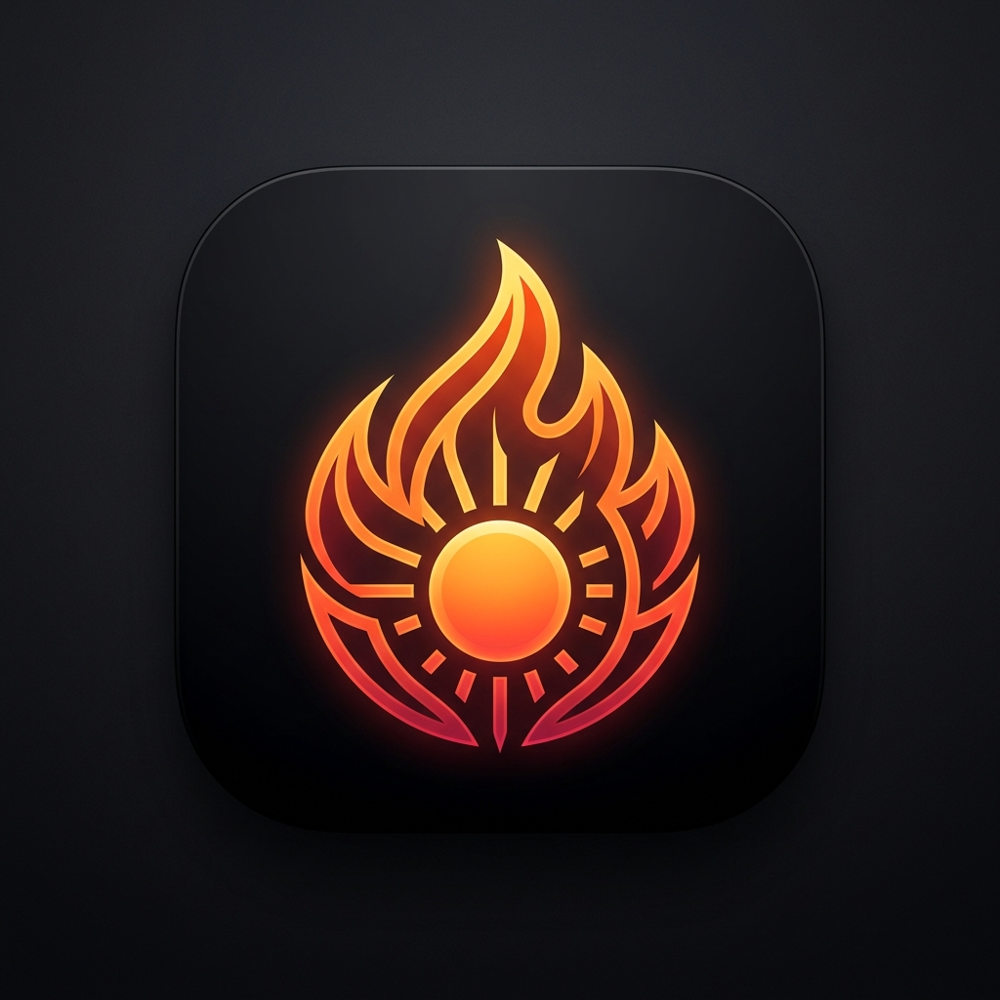
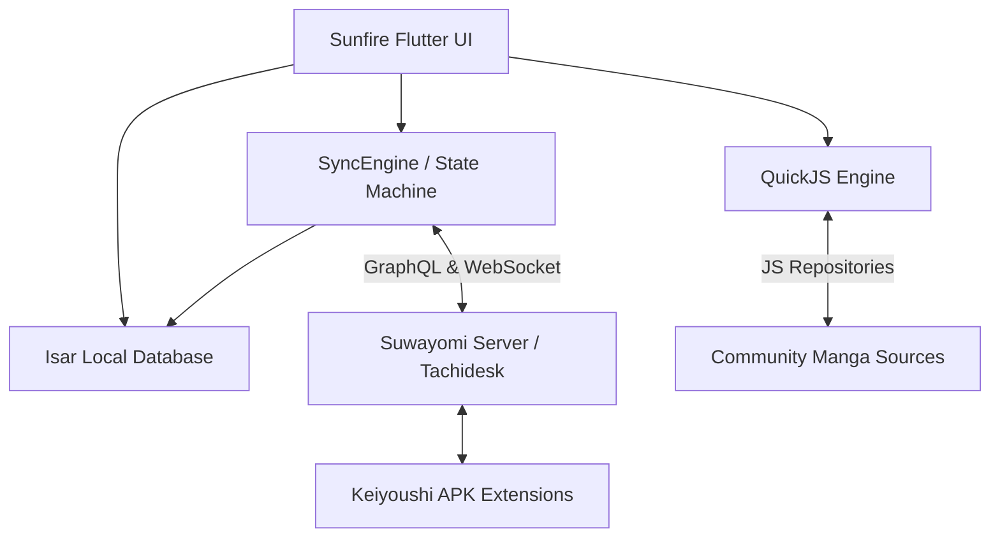

<div align="center">
  
  <h1>Sunfire</h1>
  <p><strong>A blazing fast, modern, local-first manga reader and Suwayomi client powered by Flutter & QuickJS.</strong></p>

  <a href="https://github.com/just-for-death/sunfire/releases">
    
  </a>
  
  
  
  
</div>

---

## 🌟 Overview

**Sunfire** is a next-generation local-first manga reader application designed to seamlessly bridge your self-hosted **[Suwayomi Server](https://github.com/Suwayomi/Suwayomi-Server)** backend with embedded **QuickJS community source repositories**.

Featuring a fluid OLED dark aesthetic with dynamic accent theming, instant 2-step multi-source migration search, full offline chapter caching via Isar Database, and a versatile multi-mode reader (Continuous Webtoon, Paged LTR, and RTL Manga).

---

## 🚀 Key Features

### 📖 High-Performance Reader
- **Multi-Reading Modes**: Continuous Webtoon (vertical infinite scroll), Paged Left-to-Right (LTR), and Paged Right-to-Left (RTL Japanese standard).
- **Interactive Gesture Controls**: Pinch-to-zoom and double-tap zoom via `InteractiveViewer`.
- **Chapter Quick-Jumping**: Floating bottom HUD with instant Previous/Next chapter navigation and page slider.
- **Bi-Directional Progress Sync**: Reading progress, page tracking, and read statuses sync instantly to Suwayomi GraphQL and local Isar database.

### 🔄 Multi-Source Live Migration
- **Server Parity**: Exact source-grouped library overview matching the Suwayomi server web architecture.
- **Concurrent Multi-Source Live Search**: Search for any title across all installed server and JS sources concurrently with filter chips (`📌 PINNED`, `✓ ALL`, `≡ HAS RESULTS`).
- **1-Tap Migration**: Transfer chapter reading history, last read page positions, and bookmarks across sources in a single tap.

### ⚡ Local-First & Real-Time Sync
- **Isar Embedded Database**: Ultra-fast ACID local storage for instant offline startup and zero-latency library browsing.
- **Suwayomi GraphQL & WebSocket Pipeline**: Real-time state synchronization for categories, library manga, chapter updates, and tracking services.
- **Live Unread Updates Feed**: Dedicated updates tab streaming fresh chapter drops directly from your server.

### 🎨 Modern Material You & OLED Design
- **Harmonious Dark Theme**: Pure obsidian dark backgrounds designed for battery saving on OLED displays.
- **Dynamic Accent Palette**: Customizable accent colors (Solar Amber, Cyber Teal, Neon Emerald, Electric Violet, Crimson Flame, and Dynamic Wallpaper theme).

---

## 🛠️ Architecture



---

## 📦 Getting Started

### Prerequisites
- A running **[Suwayomi Server](https://github.com/Suwayomi/Suwayomi-Server)** instance (Docker, Desktop, or LAN).
- Flutter SDK `3.x` and Dart `3.x` (for building from source).

### Connecting to Your Server
1. Launch **Sunfire**.
2. On the welcome onboarding screen (or in **Settings → Server**), enter your Suwayomi server address (e.g., `http://192.168.1.100:4567` or `http://localhost:4567`).
3. Tap **Test & Connect** — your library, categories, reading history, and sources will synchronize automatically.

---

## 🔧 Building from Source

```bash
# Clone repository
git clone https://github.com/just-for-death/sunfire.git
cd sunfire

# Install dependencies
flutter pub get

# Run on Linux Desktop
flutter run -d linux

# Build Release APK for Android
flutter build apk --release --split-per-abi

# Run test suite
flutter test
```

---

## 🤝 Acknowledgements

Sunfire is built upon and inspired by the incredible open-source manga community:
- **[Suwayomi](https://github.com/Suwayomi)** — The self-hosted backend powering self-hosted manga libraries.
- **[Tachidesk-Sorayomi](https://github.com/Suwayomi/Tachidesk-Sorayomi)** — The foundational Flutter client.
- **[QuickJS](https://bellard.org/quickjs/)** — Lightweight embedded JavaScript engine for community extensions.
- **[Isar Database](https://isar.dev)** — High-performance embedded NoSQL database for Flutter.

---

## 📄 License

Distributed under the **Mozilla Public License 2.0 (MPL-2.0)**. See [`LICENSE`](LICENSE) for details.
